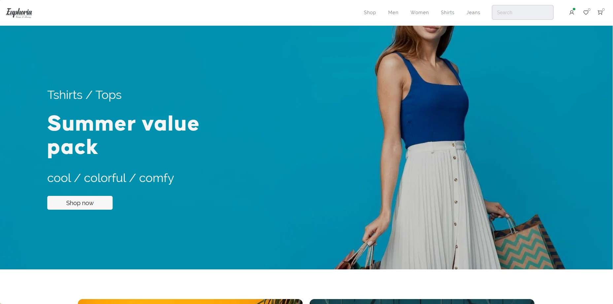

# Euphoria Cloth Shopping App

Welcome to Euphoria, a cloth shopping app built using Next.js, TypeScript, and Zustand! Euphoria provides a complete shopping experience by mimicking an e-commerce application. It allows users to browse through a variety of clothing items, add them to their cart, and simulate the checkout process. Please note that this app does not have a backend or database; instead, it temporarily stores data in state for demonstration purposes.

## Features

- **Product Listing**: Browse through a collection of clothing items, each displayed with details such as name, price, and an image.

- **Product Details**: Click on a product to view its detailed information, including larger images, descriptions, and available sizes.

- **Shopping Cart**: Add products to your cart, view the items in your cart, and see the total price. You can also adjust the quantity of items in the cart or remove them.

- **Checkout Simulation**: Experience a simulated checkout process. Although no real transactions occur, you can follow the steps and see how the app responds.

- **Responsive Design**: The app is designed to be responsive, ensuring a seamless experience across various screen sizes and devices.

## Live Demo

Check out the live demo of the app [here](https://euphoria-ivory.vercel.app)

## Getting Started

To run the Euphoria app locally:

1. Clone this repository: `git clone https://github.com/moses-py/euphoria.git`
2. Navigate to the project directory: `cd euphoria`
3. Install dependencies: `npm install`
4. Start the development server: `npm run dev`
5. Open your browser and visit `http://localhost:3000` to view the app.

## Technologies Used

- Next.js: A React framework for building server-rendered applications.
- TypeScript: A statically typed superset of JavaScript, adding optional types.
- Zustand: A state management library for React applications with a focus on simplicity and performance.
- Vaul: A library for creating amazing pull up drawers similar to that of an application

## Data Management

The app utilizes Zustand to manage the application state, including product data, cart contents, and checkout simulation. Since this app does not have a backend, the data is temporarily stored in the state.

## Contributing

Contributions are welcome! If you'd like to enhance the app, add new features, or improve the design, feel free to open issues and submit pull requests.

## Contact

If you have any questions or feedback, please contact us at [dantereus1@gmail.com](mailto:dantereus1@gmail.com).

---

Thank you for using Euphoria Cloth Shopping App! We hope you enjoy the shopping experience provided by our app, and we appreciate your interest and support.
